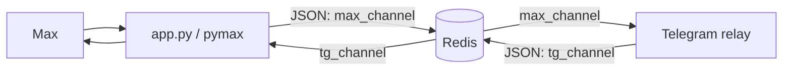

# MaxMessanger-Ressender

Сервис пересылает сообщения и вложения между Max и Telegram через Redis Pub/Sub. Клиент Max работает в этом проекте, а Telegram-бот или другой совместимый сервис выступает второй стороной обмена.

## Архитектура



`app.py` получает события Max, скачивает вложения и публикует сообщение в `max_channel`. В обратном направлении `channel_to_bot.py` читает `tg_channel`, а `tg_integration.py` находит чат Max по названию или имени собеседника и отправляет туда текст и медиа.

Репозиторий сам по себе не запускает Telegram-бот: для полного обмена нужен потребитель `max_channel` и производитель `tg_channel`, например совместимый бот из соседнего проекта. Если включён `MAX_DEBUG`, используются каналы `max_channel_debug` и `tg_channel_debug`.

## Требования

- Python с поддержкой версий библиотек из `requirements.txt`.
- Доступный сервер Redis.
- Учётная запись Max и данные для входа.
- Telegram relay, если нужна пересылка в Telegram.

## Установка

Создайте виртуальное окружение и установите зависимости:

```powershell
python -m venv .venv
.\.venv\Scripts\Activate.ps1
python -m pip install -r requirements.txt
```

На Linux или macOS активируйте окружение командой:

```bash
source .venv/bin/activate
python -m pip install -r requirements.txt
```

Создайте локальный файл `.env` из `.env.example` и задайте параметры подключения. Например, в PowerShell:

```powershell
Copy-Item .env.example .env
```

Добавьте в `.env` адрес Redis, если его ещё нет:

```dotenv
REDIS_URL=redis://localhost:6379/0
```

Запустите Redis и затем приложение:

```bash
python app.py
```

При первом запуске Max-клиент может запросить подтверждение входа. Файл сессии сохраняется согласно настройке `MAX_SESSION` и позволяет повторно использовать авторизацию.

## Переменные окружения

| Переменная | Обязательность | Назначение |
| --- | --- | --- |
| `MAX_PHONE` | Да | Номер телефона учётной записи Max. |
| `REDIS_URL` | Да для обмена через Redis | URL Redis, например `redis://localhost:6379/0`. В `.env.example` он не задан. |
| `MAX_SESSION` | Нет | Имя файла сессии; по умолчанию `session.db`. |
| `MAX_TOKEN` | Нет | Уже полученный токен Max, если он используется. |
| `MAX_WORK_DIR` | Нет | Рабочая директория Max-клиента; по умолчанию `.`. |
| `MAX_DEVICE_TYPE` | Нет | Тип устройства для клиента; по умолчанию `DESKTOP`. |
| `MAX_DEBUG` | Нет | Включает диагностические сообщения и суффикс `_debug` у Redis-каналов при значениях `1`, `true` или `yes`. |

В `.env.example` также есть дополнительные параметры и `TELEGRAM_BOT_TOKEN`/`TELEGRAM_CHAT_ID`. В текущем `app.py` они не используются: блок запуска Telegram-клиента оставлен закомментированным. Настройки пересылки Telegram задаются на стороне Telegram relay.

## Формат сообщений Redis

Сообщения передаются в JSON.

Из Telegram в Max ожидаются поля `recipient_chat` и `text`; `media` необязателен и содержит типы вложений с локальными путями к файлам:

```json
{
  "recipient_chat": "Название чата или имя пользователя",
  "text": "Текст сообщения",
  "media": {
    "photo": "downloads/photo.jpg"
  }
}
```

Сообщения из Max публикуются с полями `message`, `sender`, `id` и `text`; при наличии вложений добавляется `media` со списками локальных путей. Поддерживаемые типы включают фото, аудио, стикеры, видео и файлы. Вложения сохраняются в `downloads/` относительно текущей рабочей директории.

